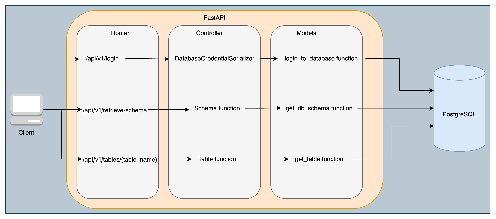

## FastAPI

### API Deployment and Usage

The following repository deals with an API using FastAPI and a PostgreSQL database.

It is deployed using docker-compose.

To run the container, you have to execute the following command:

```bash 
docker-compose up
```

There are three different endpoints to be used.
The important thing is to perform the /login endpoint first in order to be able to perform the other two requests.

```bash
http://localhost:8000/api/v1/login
```

This endpoint receives the following data in its body:

```bash 
{
    "username": "adminuser",
    "password": "adminpassword",
    "host" : "db",
    "db_name": "postgresdatabase"
}
```

These credentials will allow the user to access the database and perform the other queries.

To extract the schema of the tables:
```bash
http://localhost:8000/api/v1/retrieve-schema
```


To extract the schema of a table:
```bash
http://localhost:8000/api/v1/tables/{table}
```
By default, the application deploy creates 2 tables, users and cars.

To run the test, execute:
```bash
cd app
pytest test.py
```

### FastAPI Diagram




#### FastAPI Endpoints description

Login Endpoint:
- Path: /api/v1/login
- Method: POST
- Input: User credentials (username, password, host, db_name)
- Function: Allow users to use the database creating a object.

Endpoint to Retrieve Database Schema:
- Path: /api/v1/retrieve-schema
- Method: GET
- Input: None
- Function: Returns the database schema associated with the stored credentials.

Endpoint to Search a Table:
- Path: /api/v1/tables/{table_name}
- Method: GET
- Input: Table name
- Function: Searches and returns information about a specific table within the database.


#### DataModel for PostgreSQL database.

Table users:
- id: Primary key, autoincremental integer.
- username: Text string, must be unique and not null.
- password: Text string, not null. Should store a hash of the password, not the plaintext password.
- email: Text string, must be unique and not null.
- created_at: Timestamp, the time and date the user was created, with time zone.

Table cars:
- id: Primary key, autoincremental integer.
- brand: Text string, not null.
- model: Text string, not null.
- year: Text string, must be unique and not null 
-created_at: Timestamp, the time and date of creation of the car record, with time zone.